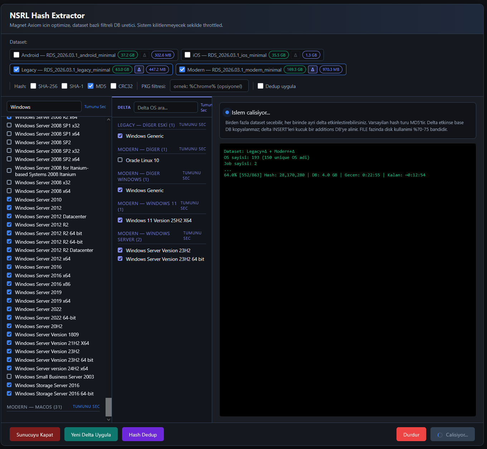

# NSRL Hash Extractor

> Generate Magnet Axiom-compatible filtered hash databases from NIST NSRL RDSv3 Minimal datasets.  
> NIST NSRL RDSv3 Minimal veritabanlarından Magnet Axiom uyumlu filtrelenmiş hash veritabanları üretin.



---

## English

### What is this?

A GUI + CLI tool that extracts a targeted subset of hashes from the [NIST NSRL RDS (Reference Data Set)](https://www.nist.gov/itl/ssd/software-quality-group/national-software-reference-library-nsrl/nsrl-download/current-rds) and produces a compact SQLite database importable directly into **Magnet Axiom** as a Known Good hash set.

Instead of importing the full 181 GB Modern database into Axiom, you select only the operating systems you care about (e.g. Windows 10 + Windows 11) and get a 2–10 GB filtered output — dramatically faster to import and search.

### Features

- **Web-based GUI** — dark-themed single-page app, no browser extensions needed
- **Multi-dataset** — combine Modern + Legacy + iOS + Android in one run
- **Delta support** — per-dataset Δ toggle applies the latest NSRL delta SQL on top of the base DB
- **OS selection** — searchable checkbox list grouped by dataset; Windows entries pre-selected for Modern
- **Parallel FILE copy** — 2–4 reader threads saturate SSD bandwidth; auto-scaled to disk type and RAM
- **Hash dedup** — removes cross-dataset duplicate hash rows after all jobs finish on the merged DB
- **Live progress** — SSE stream with `\r` terminal emulation (progress bar updates in-place)
- **Portable** — ships with a self-contained Python 3.12 embeddable runtime; no system Python needed
- **CLI mode** — full `argparse` interface for scripting and automation

### Requirements

- Windows 10 / 11 (64-bit)
- ~200 MB free disk for the tool itself
- NSRL RDSv3 Minimal databases downloaded from NIST (stored under `NSRL\`)
- Internet connection **only** for first-time setup

### Setup (once)

```bat
setup.bat
```

Downloads Python 3.12 embeddable into `python_embed\` and installs pip. Requires internet.

### Download NSRL Databases

1. Go to the [NIST NSRL download page](https://www.nist.gov/itl/ssd/software-quality-group/national-software-reference-library-nsrl/nsrl-download/current-rds)
2. Download the **Minimal** editions of the datasets you need (Modern, Legacy, Android, iOS)
3. For each dataset, also download its **delta** file if you want the latest hashes
4. Extract each zip into a subfolder under `NSRL\` — the folder name does not matter, the tool auto-discovers any `.db` file inside:

```
NSRL\
├── RDS_2026.03.1_modern_minimal\
│   └── RDS_2026.03.1_modern_minimal.db       (181 GB)
├── RDS_2026.03.1_modern_minimal_delta\
│   └── RDS_2026.03.1_modern_minimal_delta.sql
├── RDS_2026.03.1_legacy_minimal\
│   └── RDS_2026.03.1_legacy_minimal.db        (67 GB)
└── RDS_2026.03.1_legacy_minimal_delta\
    └── RDS_2026.03.1_legacy_minimal_delta.sql
```

> The `NSRL\` folder is created automatically when you first run `run_gui.bat`. You only need to place the downloaded files inside it.

### Running

```bat
run_gui.bat
```

Starts the web server on port 8080 and opens `http://localhost:8080` in your default browser automatically.

### Workflow

```
1. Select dataset(s)  →  Modern / Legacy / iOS / Android checkboxes (multi-select)
2. Enable delta       →  Click Δ button next to each dataset to include delta SQL
3. Select OS(es)      →  Left sidebar = base OS entries, right sidebar = delta OS entries
                         Modern: Windows 7/8/10/11/Server pre-selected (~132 entries)
4. Hash types         →  SHA-256 / SHA-1 / MD5 / CRC32 — MD5 only is usually enough
5. Dedup              →  Optional — removes duplicate hashes across datasets after merge
6. Start              →  Real-time log streams to the terminal panel
7. Done               →  output\<slug>.db  →  import into Magnet Axiom
```

### Importing into Magnet Axiom

1. Open Axiom → **Tools → Manage Custom Hash Sets**
2. **Add** → select the generated `.db` file
3. **Hash Set Type:** Known Good
4. Axiom processes the set and adds it to `HashList.db`

### CLI Usage

```bat
:: Windows 10 + 11 with delta, MD5 only
python_embed\python.exe nsrl_extractor.py ^
  --dataset RDS_2026.03.1_modern_minimal ^
  --os-list-file win_filter.txt ^
  --apply-delta ^
  --hash-types md5 ^
  -o output\win10-win11.db

:: Deduplicate hashes in an existing DB
python_embed\python.exe nsrl_extractor.py --dedup-db output\win10-win11.db

:: Append a new delta to an existing DB (~2–5 min)
python_embed\python.exe nsrl_extractor.py ^
  --append-delta ^
  --existing output\win10-win11.db ^
  --delta "NSRL\RDS_2026.03.1_modern_minimal_delta\RDS_2026.03.1_modern_minimal_delta.sql"
```

### Dataset Reference

| Dataset | Base DB size | Row count | OS filter |
|---|---|---|---|
| Modern | 181 GB | ~433M | Works (~352 OS entries) |
| Legacy | 67 GB | ~250M | Works (XP, Vista, Win7, Server 2003/2008) |
| Android | 40 GB | ~180M | Works (Android 2.2–13) |
| iOS | 38 GB | ~200M | Not applicable — use `--os-filter "%"` |

### Expected Duration (SSD, Modern + delta, Win10+Win11 selection)

| Phase | Time |
|---|---|
| Delta SQL → `_additions.db` | 15–30 min |
| VERSION / OS / MFG / PKG copy | 2–5 min |
| FILE parallel copy (~4% hit rate on 433M rows) | 20–45 min |
| Hash dedup (optional) | 5–20 min |
| **Total** | **~45–90 min** |

### Project Structure

```
NSRLExtractor\
├── nsrl_extractor.py     ← extraction engine (CLI + job-file mode)
├── gui_app.py            ← HTTP server, SSE progress, job orchestration
├── index.html            ← single-page dark UI
├── run_gui.bat           ← launch GUI (auto-opens browser)
├── setup.bat             ← first-time portable Python setup
├── CLAUDE.md             ← full technical manifest
├── NSRL\                 ← put NIST databases here (not in repo)
└── output\               ← generated .db files land here (not in repo)
```

---

## Türkçe

### Bu nedir?

[NIST NSRL RDS (Referans Veri Seti)](https://www.nist.gov/itl/ssd/software-quality-group/national-software-reference-library-nsrl/nsrl-download/current-rds) veritabanlarından hedeflenmiş bir hash alt kümesi çıkararak doğrudan **Magnet Axiom**'a "Known Good" hash seti olarak aktarılabilecek kompakt SQLite dosyaları üreten bir GUI + CLI araçtır.

181 GB'lık Modern veritabanının tamamını Axiom'a aktarmak yerine yalnızca ilgilendiğiniz işletim sistemlerini (örn. Windows 10 + Windows 11) seçerek 2–10 GB'lık filtrelenmiş bir çıktı elde edersiniz.

### Özellikler

- **Web tabanlı arayüz** — karanlık temalı tek sayfa uygulama
- **Çoklu dataset** — Modern + Legacy + iOS + Android aynı anda seçilebilir
- **Delta desteği** — her dataset'in kendi Δ toggle'ı; delta SQL otomatik uygulanır
- **OS seçimi** — aranabilir onay kutusu listesi; Modern için Windows girdileri önceden seçili
- **Paralel FILE kopyalama** — 2–4 okuyucu iş parçacığı; disk tipi ve RAM'e göre otomatik ayar
- **Hash dedup** — tüm dataset'ler birleştirildikten sonra çift hash satırlarını temizler
- **Canlı ilerleme** — SSE akışı, `\r` terminal emülasyonu ile yerinde güncellenen ilerleme çubuğu
- **Taşınabilir** — Python 3.12 embeddable ile birlikte gelir; sistemde Python kurulu olmasına gerek yok
- **CLI modu** — otomasyon için tam `argparse` arayüzü

### Gereksinimler

- Windows 10 / 11 (64-bit)
- Araç için ~200 MB boş disk alanı
- NIST'ten indirilmiş NSRL RDSv3 Minimal veritabanları (`NSRL\` altına yerleştirilmiş)
- İnternet bağlantısı **yalnızca** ilk kurulum için

### Kurulum (bir kez)

```bat
setup.bat
```

Python 3.12 embeddable'ı `python_embed\` klasörüne indirir ve pip kurar. İnternet gerektirir.

### NSRL Veritabanlarını İndirme

1. [NIST NSRL indirme sayfasına](https://www.nist.gov/itl/ssd/software-quality-group/national-software-reference-library-nsrl/nsrl-download/current-rds) gidin
2. İhtiyacınız olan dataset'lerin **Minimal** sürümlerini indirin (Modern, Legacy, Android, iOS)
3. En güncel hash'ler için her dataset'in **delta** dosyasını da indirin
4. Her zip'i `NSRL\` altında bir alt klasöre çıkartın — klasör adı önemli değil, araç içindeki `.db` dosyasını otomatik bulur:

```
NSRL\
├── RDS_2026.03.1_modern_minimal\
│   └── RDS_2026.03.1_modern_minimal.db       (181 GB)
├── RDS_2026.03.1_modern_minimal_delta\
│   └── RDS_2026.03.1_modern_minimal_delta.sql
├── RDS_2026.03.1_legacy_minimal\
│   └── RDS_2026.03.1_legacy_minimal.db        (67 GB)
└── RDS_2026.03.1_legacy_minimal_delta\
    └── RDS_2026.03.1_legacy_minimal_delta.sql
```

> `NSRL\` klasörü `run_gui.bat` ilk çalıştırıldığında otomatik oluşturulur. Yalnızca indirdiğiniz dosyaları bu klasörün içine koymanız yeterlidir.

### Çalıştırma

```bat
run_gui.bat
```

8080 portunda web sunucusu başlatır ve tarayıcıyı otomatik olarak `http://localhost:8080` adresinde açar.

### Kullanım Akışı

```
1. Dataset seç       →  Modern / Legacy / iOS / Android onay kutuları (çoklu seçim)
2. Delta etkinleştir →  Her dataset'in yanındaki Δ butonuna tıkla
3. OS seç            →  Sol sidebar = base OS girdileri, sağ sidebar = delta OS girdileri
                         Modern: Windows 7/8/10/11/Server önceden seçili (~132 giriş)
4. Hash türleri      →  SHA-256 / SHA-1 / MD5 / CRC32 — genellikle yalnızca MD5 yeterli
5. Dedup             →  İsteğe bağlı — tüm dataset'ler birleştikten sonra çift hash'leri siler
6. Başlat            →  Terminal paneline gerçek zamanlı log akışı
7. Hazır             →  output\<slug>.db  →  Magnet Axiom'a aktar
```

### Magnet Axiom'a Aktarım

1. Axiom → **Tools → Manage Custom Hash Sets**
2. **Add** → üretilen `.db` dosyasını seç
3. **Hash Set Type:** Known Good
4. Axiom hash setini işler ve `HashList.db`'ye ekler

### Beklenen Süreler (SSD, Modern + delta, Win10+Win11 seçimi)

| Aşama | Süre |
|---|---|
| Delta SQL → `_additions.db` | 15–30 dk |
| VERSION / OS / MFG / PKG kopyalama | 2–5 dk |
| FILE paralel kopyalama (~433M satırda ~%4 hit oranı) | 20–45 dk |
| Hash dedup (isteğe bağlı) | 5–20 dk |
| **Toplam** | **~45–90 dk** |

### Dataset Referansı

| Dataset | Base DB boyutu | Satır sayısı | OS filtresi |
|---|---|---|---|
| Modern | 181 GB | ~433M | Çalışıyor (~352 OS girdisi) |
| Legacy | 67 GB | ~250M | Çalışıyor (XP, Vista, Win7, Server 2003/2008) |
| Android | 40 GB | ~180M | Çalışıyor (Android 2.2–13) |
| iOS | 38 GB | ~200M | Uygulanamaz — `--os-filter "%"` kullan |

### CLI Kullanımı

```bat
:: Windows 10 + 11, delta dahil, yalnızca MD5
python_embed\python.exe nsrl_extractor.py ^
  --dataset RDS_2026.03.1_modern_minimal ^
  --os-list-file win_filter.txt ^
  --apply-delta ^
  --hash-types md5 ^
  -o output\win10-win11.db

:: Mevcut DB'deki çift hash satırlarını temizle
python_embed\python.exe nsrl_extractor.py --dedup-db output\win10-win11.db

:: Mevcut DB'ye yeni delta ekle (~2–5 dk)
python_embed\python.exe nsrl_extractor.py ^
  --append-delta ^
  --existing output\win10-win11.db ^
  --delta "NSRL\RDS_2026.03.1_modern_minimal_delta\RDS_2026.03.1_modern_minimal_delta.sql"
```

---

## License / Lisans

This tool is provided as-is for forensic and research use. NSRL data is published by NIST and is in the public domain. This project is not affiliated with NIST or Magnet Forensics.

Bu araç adli bilişim ve araştırma amaçlı olarak olduğu gibi sunulmaktadır. NSRL verisi NIST tarafından yayımlanmakta olup kamuya açıktır. Bu proje NIST veya Magnet Forensics ile herhangi bir bağlantıya sahip değildir.
